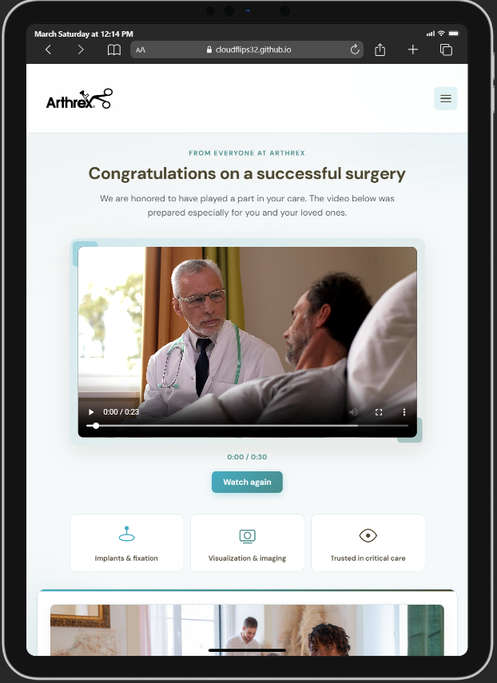

<div align="center">


# Patient Call-To-Life — responsive web experience

**A supportive, tablet-friendly page for patients after surgery — from Arthrex.**

<br/>

</div>

<div align="center">
    
</div>

---

## At a glance

| | |
| :--- | :--- |
| **Purpose** | Welcome patients after successful surgery with a short message, branded video, and recovery encouragement. |
| **Audience** | Patients and families in a hospital or recovery setting (e.g. shared tablet). |
| **Stack** | Static HTML, CSS, and JavaScript — no build step required. |

---

## Why this page exists

🏥 **Clinical context**  
After surgery, patients often need rest — not paperwork. This page gives a **single calm screen**: congratulations, a **30-second** stitched video with medical stock footage, **timed on-screen text**, and a **recovery** section with a family-oriented image.

🤝 **Brand & trust**  
Header and footer carry the **Arthrex** identity, **aligned** with page gutters on desktop and **centered** footer branding on small screens.

---

## Features

| Icon | Feature |
| :---: | --- |
| 📱 | **Responsive layout** — readable on phone, tablet, and desktop; shared `--page-gutter` and content max-width. |
| 🍔 | **Hamburger menu** — navigation links (Your message / Video / Recovery) in a **right-aligned** dropdown. |
| 🎬 | **Single message video** — `assets/welcome-back.mp4` with native **controls**; timed overlay copy **only while playing** (`segments` in `main.js`). |
| 🎨 | **Brand palette** — `#46ACC2`, `#498C8A`, `#4D4730` used across UI and graphics. |
| 🔗 | **Footer social links** — LinkedIn, Facebook, Instagram, YouTube, X (opens in a new tab). |
| ♿ | **Accessibility** — semantic landmarks, `aria-*` on menu and video, `alt` text on images, focus styles. |

---

## How to run locally

1. **Open the site**  
   Open `index.html` in a modern browser (Chrome, Edge, Firefox, Safari).

2. **Optional: local server** (recommended for video and network assets)  
   From the project folder:

   ```bash
   npx serve .
   ```

   Then visit the URL shown in the terminal (often `http://localhost:3000`).

---

## Project layout

```
arthrex/
├── index.html          # Page structure, header, main, footer
├── styles.css          # Layout, responsive rules, Arthrex colors
├── main.js             # Menu, timed video overlay copy
├── README.md           # This file
└── assets/
    ├── arthrex-logo.svg    # Vector logo (footer / reference)
    ├── 600x400_arthrex.png # Header logo
    ├── welcome-back.mp4    # Main message video (add your file)
    ├── video-poster.svg    # Video poster art
    └── patient-doctor.jpg  # Support section photo (see attribution in HTML)
```

---

## Media & attribution

- **Video** — Local file `assets/welcome-back.mp4` (see `index.html`). Optional: `scripts/combine-patient-video.ps1` can build a combined MP4 from Mixkit sources.  
- **Support photo** — Pexels (Kampus Production); comment in `index.html` points to the asset page.  
- **Arthrex logos** — Use official brand assets from Arthrex for production; filenames here are placeholders for layout.

---

## Customization tips

- **Swap the video** — Set `src` on the `<video>` in `index.html`. Adjust `segments[].start` in `main.js` if the runtime or beat of your MP4 changes.  
- **Social URLs** — Update `href` values in the footer in `index.html` to match current Arthrex channels.  
- **Copy** — Hero, overlay segments, and support copy are in `index.html` and `main.js` (`segments` array).

---

<div align="center">

<sub>Educational / demo layout. For clinical or commercial use, follow Arthrex brand guidelines and your compliance team.</sub>

</div>
